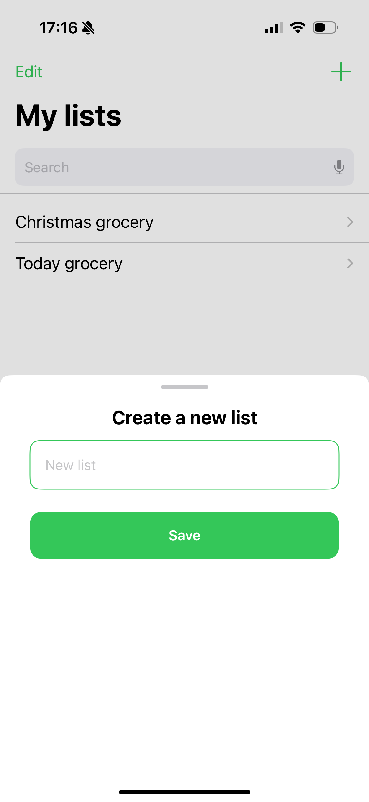
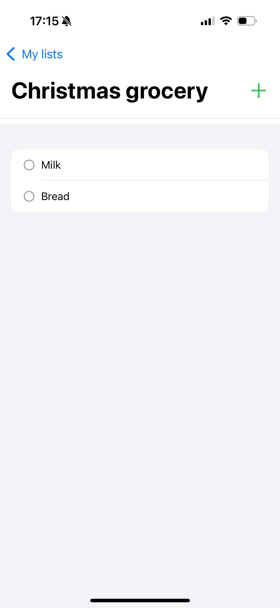

# Listify
Listify is an app created for anyone who wants to organize tasks easily and efficiently. Whether you're managing a to-do list, planning your shopping, or setting reminders, Listify helps you stay on top of everything in a simple way.

🚀 Features
* Create customizable lists for all your needs.
* Add new items and organize them quickly.
* Mark tasks as completed to track your progress.

🔨 Installation
1. Clone this repository: `git clone <https://github.com/Ilypiz/Listify.git>
2. Open the project in Xcode.
3. Run the app on a simulator or connected device.

📑License

This project is licensed under the MIT License. 

## Screenshot

   
